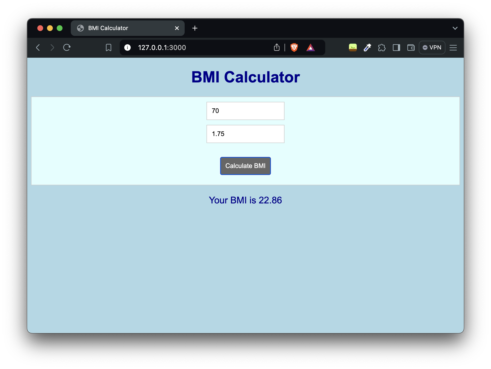

# BMI Calculator

A simple web application to calculate Body Mass Index (BMI) using Node.js and Express.


## Description

This project provides a web interface to input weight and height, and calculates the BMI based on the provided values. The server is built using Node.js and Express, and the frontend is a simple HTML form.

## Installation

1. Clone the repository:

   ```sh
   git clone https://github.com/LasithRanahewa/bmi-calculator.git
   cd bmi-calculator
   ```
2. Install the dependencies:

   ```sh
   npm install
   ```

## Usage

1. Start the server:

   ```sh
   node server.js
   ```
2. Open your web browser and navigate to:

   ```
   http://localhost:3000
   ```
3. Enter your weight in kilograms and height in meters, then click "Calculate BMI" to see your BMI.

## Endpoints

### POST /

Calculates the BMI based on the provided weight and height.

- **URL**: `/`
- **Method**: `POST`
- **Headers**: `Content-Type: application/json`
- **Body**:
  ```json
  {
      "weight": "70",
      "height": "1.75"
  }
  ```
- **Success Response**:
  - **Code**: 200
  - **Content**:
    ```json
    {
        "bmi": "22.86"
    }
    ```
- **Error Response**:
  - **Code**: 400
  - **Content**:
    ```json
    {
        "error": "Invalid input"
    }
    ```


